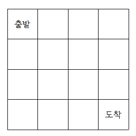

# Q-Learning

## **Q-Learning을 이용한 미로 찾기**

### **미로**

<br>
- 목표 : 출발 지점에서 도착 지점까지 가장 빠른 경로로 미로 탐색

### **가이드 라인**
+ **Q-table 채우기**
1) 미로(state)의 랜덤한 위치에서 시작 (state : (col,row))
2) 랜덤한 행동을 선택
3) 선택한 행동에 따라 보상(reward)과 다음 위치(next state)결정
4) 벨만 방정식을 통해 Q값 계산 후 Q_table 채워 나가기
5) 1000번 반복하면서 Q_table update  
<br>

 
+ **Q-table을 이용해 최적 경로로 도착점까지 가기**
1) 시작 지점을 (0,0)으로 하고 시작
2) 해당 state에서 가장 큰 Q값을 얻을 수 있는 행동을 선택
3) 선택한 행동에 따라 next state 결정
4) 도착 지점 (3,3)에 도달할 때까지 반복

<br>

+ **시간차 공식**
$$TD_t(s_t, a_t) = R(s_t, a_t) + \gamma \max_{a} (Q(s_{t+1}, a)) - Q(s_t, a_t)$$

<br>

+ **벨만 방정식**
$$Q_t(s_t, a_t) = Q_{t-1}(s_t, a_t) + \alpha \text{TD}_t(s_t, a_t)$$


```python
import numpy as np

#보상 행렬(col*row*actions)
r_table = np.ones((4,4,4),dtype=int)

#Q값 행렬
q_table = np.zeros((4,4,4))

#행동 [위 : 0, 아래 : 1, 왼쪽 : 2, 오른쪽 : 3]

# r_table 채우기
# 1. 미로 밖으로 나가는 행동을 했을 때의 보상 (미로 밖으로 나가면 보상을 0으로)
# ex) r_table[0,2,1]은 col이 0이고 row가 2인 state에서 아래로 가는 행동을 했을 때 얻는 보상
# Write Your Code

# 2. 목표 지점으로 도착했을 때의 보상 (목표 지점인 (3,3)에 도착하면 보상을 1000으로)
# Write Your Code

#costant
gamma = 0.9
alpha = 0.7

def get_random_state():

    col = np.random.randint(0,4)
    row = np.random.randint(0,4)

    while col == 3 and row == 3:
        return get_random_state()
    
    return (col, row)

def get_random_action(state):
    
    action = r_table[state] # action : 해당 상태에서 수행할 수 있는 모든 행동의 벡터
    avil_actions = np.where(action != 0)[0] # 그 중 reward가 0이 아닌 행동, 즉 수행할 수 있는 행동을 결정
    return np.random.choice(avil_actions) # 수행할 수 있는 행동 중 랜덤한 행동 수행

def step(state, action):
    # 해당 state에서 action을 취했을 때의 보상 뽑기
    # Write Your Code (reward = ...)

    action_table = {0:(0,-1), 1:(0,1), 2:(-1,0), 3:(1,0)}

    # 취한 action에 따라 next state 결정
    next_state = np.array(state) + action_table[action]
    next_state = tuple(next_state)

    return next_state, reward

def update_Q(state, action, reward, next_state):
# 시간차 공식과 벨만 방정식을 이용해 Q값 업데이트
    global q_table
    # Write Your Code 

# main
# Q_table 채우기
for i in range(1000):
    state = get_random_state() 
    action = get_random_action(state)
    next_state, reward = step(state, action)
    update_Q(state, action, reward, next_state)

# 완성한 Q_table로 시작점에서 목적지까지 최단 경로로 이동
state = (0, 0)
while True:
    # Write Your Code 
    print(state)
    if state == (3, 3):
        break
```
